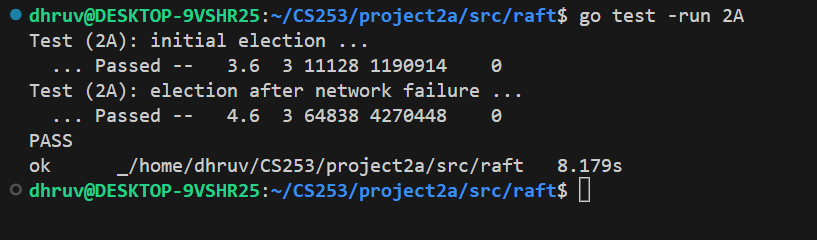
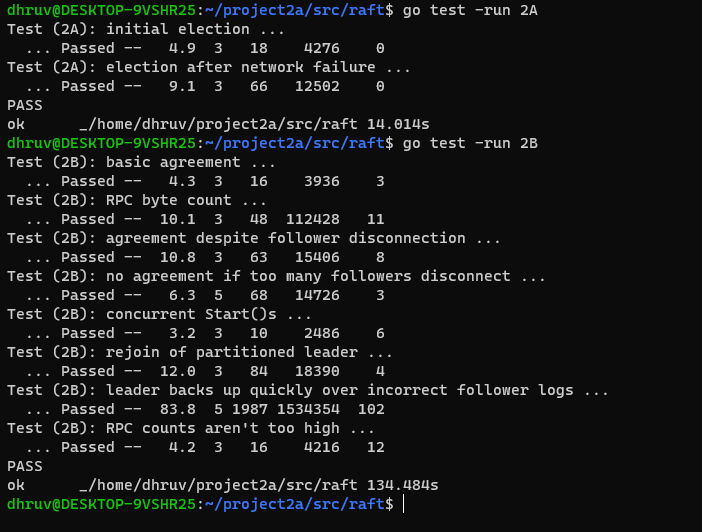

# CS 253 Project 1: MapReduce
# CS 253 Project 2A: Raft Leader election

## Changes made to the files

We made changes to raft.go file in `src/raft` for [project 2A](#Changes-to-raft.go-for-project-2A:) and [project 2B](#Changes-to-raft.go-for-project-2B:).

### Changes to raft.go for project 2A:

#### States and Structures:

Aded `state` field to track whether a given Raft peer is a Follower, Candidate, or Leader, with the respective states defined as constants.

Updated `RequestVoteArgs` and `RequestVoteReply` structures to include additional fields for the voting process.

Added `AppendEntriesArgs` and `AppendEntriesReply` for leader's RPCs.

#### Variables:

Added `latestTerm` field to the `Raft` struct to manage the current term of the peer.

Added `votedCandidate` and `voteCount` fields to the `Raft` struct to track the candidate a peer has voted for and the number of votes received, respectively.

Added `timer` field to the `Raft` struct to trigger a new election if a leader has not been heard from within a certain period.

#### Functions:

Updated `RequestVote` RPC handler to handle the above voting dynamics.

Added function `electAfterTimeout()` to check for timeout and initiate a new election when necessary.

Added `loopRaftStates()` to run in a separate goroutine and manage the state transitions of the Raft node based on its current state and other conditions.

In the `Make()` function, additional fields in the `Raft` struct are initialized and the `loopRaftStates()` goroutine is launched.

Added following functions for the leader to manage the Raft cluster:

`heartBeat()`: Allows the leader to send a heartbeat (an empty AppendEntries RPC) to all peers, indicating that the leader is still active.

`heartBeatAfterTimeout()`: Triggers the `heartBeat()` function after a specified time period, ensuring regular communication from the leader to followers.

`sendAppendEntries()`: Enables the leader to send an AppendEntries RPC (used for log replication and heartbeat) to a specified follower.

`AppendEntries()`: RPC handler function executed by a follower upon receiving an AppendEntries RPC.

`SendAppendEntriesHandler()`: To concurrently handle the `sendAppendEntries()` calls for each follower, enabling simultaneous communication from the leader to all followers.

### Changes to raft.go for project 2B:

#### Variables, States and Structures:

We have expanded the `timer` to accommodate for 2B. There are two types of timers: heartbeat timer and election timer. The heartbeat timer is used by the Leader to regularly send heartbeats to all the other nodes, while the election timer is used to trigger a new election if a Follower or Candidate doesn't hear from a Leader in a while.

#### Functions:

Updated `RequestVote()`: When a candidate server wants to be elected as leader, it sends a RequestVote RPC to other servers. This function is called to handle the incoming RequestVote RPC, process it, and respond with a reply.

The updated `startElection()` function introduces mutex locks for safe concurrent access to the `Raft` object and encapsulates state conversion logic within the `convertStateTo()` method. It concurrently sends RequestVote RPCs to peers and handles the replies within the same goroutine. The function determines election victory by counting votes and transitions to the `Leader` state if it receives votes from a majority of servers. It includes log data in the RPC arguments and initializes log matching variables when becoming the leader. The leader can broadcast heartbeats to other servers, and the function handles term updates to respect newer terms in the network. Lastly, it includes a placeholder for handling RPC failure.

Updated `AppendEntries()`: If the previous log entry does not match the one in the leader's arguments, the new function sets reply.Success to false and appends the conflicting entries from the leader to its own log. It also updates the commitLogIndex if the leader's commit index is greater than the server's current commit index, and applies the newly committed log entries.

Added `broadcastHeartbeat()`: The leader uses this function to send heartbeats (which are actually AppendEntries RPCs with no log entries) to all other servers to maintain authority over the cluster and to signal that it's still operational.

Added `checkMajority()`: This function is used by the leader to determine if a log entry is safe to commit. A log entry is safe to commit when it has been stored on a majority of servers.

Added `electionTimer()`: The election timer triggers a new election if a server hasn't heard from a leader in a while. This function manages the timer's behavior.

Added `heartbeatTimer()`: The heartbeat timer triggers the leader to send a heartbeat message to other servers. This function manages the timer's behavior.

Added `resetElectionTimer()`: If a server hears from a leader or gets voted as a leader, it resets its election timer.

Added `resetHeartbeatTimer()`: Whenever a leader successfully sends out heartbeats to other servers, it resets its heartbeat timer.

Added `convertStateTo(state int32)`: A server in Raft can be in one of three states: follower, candidate, or leader. This function is used to change the state of a server to one of these states.

Added `applyLogEntries()`: This function applies committed log entries to the server's state machine. A log entry must be committed before it can be applied.

In addition, we have also added small helper functions like `min()` and `max()` to facilitate the comparisons.

## Contributions

During development of this project, we worked together using the pair programming technique and made equal contributions to project.

By Dhruv Parmar and Kartikay Kaul

## Results

Here is our sample run of `go test -run 2A`:

Here is our sample run of `go test -run 2A` and `go test -run 2B` after completing 2B:

